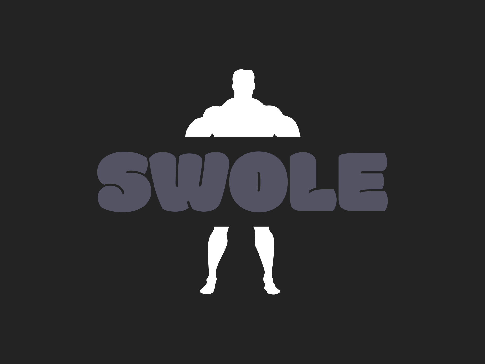

# 💪🏼 Swole 2.0 💪🏼

<center></center>

## Description

**Swole** is a mobile-ready web application that allows users to keep track of their workouts. This allows users to have an overview of all of their workouts and to keep a detailed history of their performance for each exercise. The goal is to help users achieve progressive overload by maintaining an accurate record of their previous workout sessions. Users are able to record the number of sets, reps and rest periods between each of their exercises. Swole also has an integrated timer feature to track the duration of your workouts as well as the rest intervals between each exercise.


## Motivation

One of the core principles of any type of physical training is the science of progressive overload. The key to making sure you are consistently pushing yourself and improving your performance over time is to meticulously keep track of performnace. Swole is a fitness tracking tool that helps users keep track of their workout preformance when lifting weights.

## Tech Stack

### For Front-end development


### For Back-end development


This project was built utilizing a combination of the following technologies: React.js, Node.js, Express, NoSQL database (MongoDB), Mongoose and Webpack.

**React** was utilized to create the front end of the application as it was thought to be an efficient and lightweight method of providing seamless functionality and a responsive user interface. It allows for a great deal of modularity through reusable components and, with the aid of React Hooks and the Context API, it was quite easy to manage state and pass the necessary data between components.

**Material UI** was used to style the application as it allowed for a more efficient and organized way of styling components compared to traditional CSS. It provided us with the ability to use variables and mixins which made it easier to maintain a consistent theme throughout the application that helped users differentiate between the various components for a better user experience.

**Node.js** and **Express** were used to build out the back end of the application due to their ability to handle asynchronous requests and their ability to provide a robust framework for building out the server. The use of these technologies allowed us to create a RESTful API that could be used to interact with the NoSQL database for efficient and sensible management of user data.

**MongoDB** was used to create a cloud-based NoSQL database for this application due to its flexibility as a database that was inherently well-suited to managing user data in an easily scalable manner. Specifically, it allowed us to create a non-relational database that could be used to rapidly query data with simple and high-performnace queries as well as creating multiple data structures by collating different information data types together in the same document.

**Webpack** was used to bundle the application as it allowed us to build an efficient and modular base for the application. It allowed us to use a variety of loaders to handle different file types and it also provided us with the ability to use plugins to optimize the application for production.

**Babel** was used to transpile the application as it allowed us to use the latest version of JavaScript and utilize features such as arrow functions and async/await. It also allowed us to use the latest version of React and JSX.

## Features

- Light/dark mode toggle
- Live previews
- Fullscreen mode
- Cross platform

## New Features

**Security:** A login system that securely hashes passwords and stores them in the database has been integrated into the app's feature set as well as form validation on the signup and login page.

**Bcrypt:** Implemented bcrypt and a salt in a Node.js server using JavaScript to securely hash user passwords for user authentication and add an additional layer of security, preventing attacks such as brute force and dictionary attacks.

**Testing:** Jest and React Testing Library.

## Future Goals

**OAuth:** to allow users to login using their Google or Facebook accounts. This would allow users to login to the application without having to create a new account and would also allow them to login to the application from any device without having to remember their password. This would be a great improvement for the user experience.

## Authors

- Ed Cho [LinkedIn](https://www.linkedin.com/in/edcho720/) | [GitHub](https://github.com/edcho720)

## 🔗 Links
[](https://zeusk8.io/)
[](https://www.linkedin.com/in/edcho720)
[](https://twitter.com/CyberHusky7)

## Run Locally

Clone the project

```bash
  git clone https://github.com/edcho720/Swole-2.0.git
```

Go to the project directory

```bash
  cd my-project
```

Install dependencies

```bash
  npm install
```

Start the server

```bash
  npm run start
```


## Running Tests

To run tests, run the following command

```bash
  npm run test
```

## Demo

Insert gif or link to demo

## Badges


